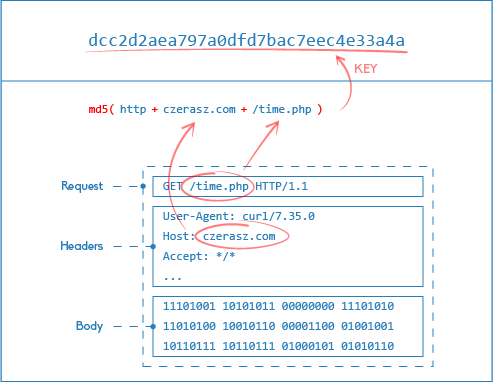
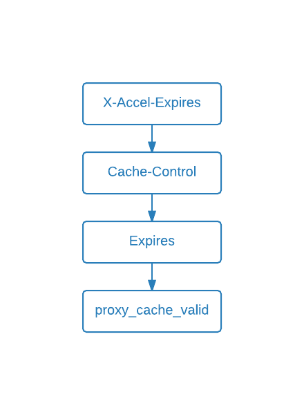

# Get Nginx Server Up and Running in Linux Ubuntu and Docker
## Index
- [Useful Nginx Commands](#useful_commands)
- [Install and Run Nginx from package manager](#install_package_manager)
- [Install and Run Nginx from source](#install_from_source)
- [Reverse Proxy Demo](#reverse_proxy)
  - [Add header to proxy request](#reverse_proxy_header)
- [Load Balancing Demo](#load_balancing)
  - [Enable Sticky Session](#load_balancing_sticky_session)
  - [Enable Load Balancing based on # of ](#load_balancing_policy)connections
- [Virtual Host's Resource Demo](#virtual_host)
  - [Add redirect](#virtual_host_redirect)
  - [Add rewrite](#virtual_host_rewrite)
  - [Disable access log example](#virtual_host_disable_access_log)
  - [Enable GZIP for faster response](#virtual_host_gzip)
  - [Enable caching](#virtual_host_enable_cache)
    - [How to test caching by Apache Bench and Siege](#cache_testing)
  - [Enable HTTPS](#virtual_host_enable_https)
  - [Redirect HTTP to HTTPS](#virtual_host_redirect_https)
  - [Enable Basic Auth (with password) for ](#virtual_host_enable_basic_auth)endpoint resources
  - [Disable XSS (cross site script sharing)](#virtual_host_disable_xss)
  - [Add Stub Status Monitoring](#monitoring)
- [Nginx Docker Demo](#nginx_docker)
  - [Original Nginx Docker Image](#original_nginx)
  - [Custom Nginx Docker Image with Dockerfile](#custom_nginx)
  - [Using docker-compose](#nginx_docker_compose)
- [Ref: best practices and pitfalls](#best_practice_pitfalls)
- [What's next (run Nginx in Kubernetes cluster!)](#whats_next)


## Useful Nginx Commands <a name="useful_commands"></a>
```
# send reload singal for a new config to take an effect
nginx -s reload

# -t to test syntax of the config, which is specified by -c
nginx -t -c /etc/nginx/nginx_demo.com/nginx.conf
```

## Nginx Config Location for this demo
For this demo purpose, we will leave the default Nginx config located at `/etc/nginx/nginx.conf` intact. Instead, we will create a `/etc/nginx/nginx_demo.com/` dir.
```
mkdir /etc/nginx/nginx_demo.com/

# change ownership of all files and dirs, and group owner the folder to www-data, recursively
chown www-data:www-data /etc/nginx/nginx_demo.com/ -R

# create html content dir
mkdir /var/www/nginx_demo.com

# change ownership of all files and dirs, and group owner the folder to www-data, recursively
chown www-data:www-data /var/www/nginx_demo.com -R
```

## Install and Run Nginx from package manager <a name="install_package_manager"></a>
1. `apt update`
2. `apt install nginx`
3. `systemctl status nginx` should return `running` status
4. `curl localhost` should return a html page

Alternatively, you can build and run Nginx from the source (more convenient for adding/removing modules)
## Install and Run Nginx from the source <a name="install_from_source"></a>
1. `wget https://nginx.org/download/nginx-1.17.2.tar.gz`
2. `tar -xvzf nginx-1.17.2.tar.gz`
3. `cd nginx-1.17.2`
4. `./configure` should return an error like 
```
./configure: error: the HTTP rewrite module requires the PCRE library
```
5. `apt install build-essential`
6. `apt install libpcre3 libpcre3-dev zlib1g zlib1g-dev libssl-dev`
7. `./configure` again with parameters:
```
./configure \
  --sbin-path=/usr/sbin/nginx \
  --conf-path=/etc/nginx/nginx.conf \
  --error-log-path=/var/log/nginx/error.log \
  --http-log-path=/var/log/nginx/access.log \
  --with-pcre --pid-path=/var/run/nginx.pid
```
And should return below this time:
```
Configuration summary
  + using system PCRE library
  + OpenSSL library is not used
  + using system zlib library

  nginx path prefix: "/usr/local/nginx"
  nginx binary file: "/usr/local/nginx/sbin/nginx"
  nginx modules path: "/usr/local/nginx/modules"
  nginx configuration prefix: "/usr/local/nginx/conf"
  nginx configuration file: "/usr/local/nginx/conf/nginx.conf"
  nginx pid file: "/usr/local/nginx/logs/nginx.pid"
  nginx error log file: "/usr/local/nginx/logs/error.log"
  nginx http access log file: "/usr/local/nginx/logs/access.log"
  nginx http client request body temporary files: "client_body_temp"
  nginx http proxy temporary files: "proxy_temp"
  nginx http fastcgi temporary files: "fastcgi_temp"
  nginx http uwsgi temporary files: "uwsgi_temp"
  nginx http scgi temporary files: "scgi_temp"
```
8. Compile it `make`
9. Check Nginx version `nginx -V`
10. `Systemctl restart nginx`
11. `curl http://localhost` should return a html page


## Reverse Proxy Demo <a name="reverse_proxy"></a>

Will create two servers from Nginx and PHP.

1. Up PHP server
```
cat > index.php << EOF
<?php
echo "hello from php server\n";
echo "Path: " . $_SERVER['REQUEST_URI'];
EOF

php -S localhost:9999 index.php
curl localhost:9999
```

2. Up Nginx server
```
cat > nginx.conf << EOF
events {}
http {
 
  server {
    listen 8888;
 
    location / {
        return 200 "Hello from custom nginx.conf\n";
    }
 
    location /php {
        # reverse proxy: should end with trailing /
        proxy_pass http://localhost:9999/;
    }
  }
}
EOF


nginx -c $PWD/nginx.conf
curl localhost:8888
```

3. Hit PHP server through Nginx (i.e. testing Nginx Reverse proxy)
```
curl localhost:9999/php
```
which should return
```
hello from php server
Path: /
```

### Add header to proxy request <a name="reverse_proxy_header"></a>
1. Modify the Nginx config and add a line
`proxy_set_header Host $host;`

`vim nginx.conf` and paste in the below:
```
events {}
http {

  server {
    listen 8888;

    location / {
        return 200 "Hello from custom nginx.conf\n";
    }

    location /php {
        # reverse proxy: should end with trailing /
        proxy_pass http://localhost:9999/;
        # set header for proxy request because add_header won't propagate to proxy header
        proxy_set_header Host $host;
    }
  }
}
```

Then reload the config:
```
nginx -s reload

# hit the Nginx server
curl localhost:8888
```

2. Modify index.php to return a header info

`vim index.php` and paste in the below:
```
<?php
echo "hello from php server\n";
echo "Path: " . $_SERVER['REQUEST_URI'];
echo "\n";
# return header info
var_dump(getallheaders());
```

```
# Then start a PHP server again:
php -S localhost:9999 index.php

# hit the PHP server
curl localhost:8888/php
```
should return a host header
```
hello from php server
Path: /
array(4) {
  ["Host"]=>
  string(9) "localhost"
  ["Connection"]=>
  string(5) "close"
  ["User-Agent"]=>
  string(11) "curl/7.47.0"
  ["Accept"]=>
  string(3) "*/*"
}
```


## Load Balancing Demo <a name="load_balancing"></a>

1. Up two PHP servers

From a shell:
```
# redirect STDIN to index1.php
cat > index1.php << EOF
<?php
echo "hello from php server 1\n";
echo "Path: " . $_SERVER['REQUEST_URI'];
echo "\n";
# return header info
var_dump(getallheaders());
EOF

# Up PHP server 1
php -S localhost:10001 index1.php
```

From another shell:
```
# redirect STDIN to index2.php
cat > index2.php << EOF
<?php
echo "hello from php server 2\n";
echo "Path: " . $_SERVER['REQUEST_URI'];
echo "\n";
# return header info
var_dump(getallheaders());
EOF

# Up PHP server 2
php -S localhost:10002 index2.php
```

Test two PHP servers are running:

`curl localhost:10001`
should return:
```
hello from php server 1
Path: /
array(3) {
  ["Host"]=>
  string(15) "localhost:10001"
  ["User-Agent"]=>
  string(11) "curl/7.47.0"
  ["Accept"]=>
  string(3) "*/*"
}
```
Likely, `curl localhost:10002` should return:
```
hello from php server 2
Path: /
array(3) {
  ["Host"]=>
  string(15) "localhost:10002"
  ["User-Agent"]=>
  string(11) "curl/7.47.0"
  ["Accept"]=>
  string(3) "*/*"
}
```

2. Add load balancing config to `nginx.conf`
```
events {}
http {
  # load balancing (must be under http{} context)
  upstream php_servers {
    server localhost:10001;
    server localhost:10002;
  }

  server {
     listen 8888;

    # reverse proxy
    location / {
        # reverse proxy: should end with trailing /
        # specify upstream name to enable load balancing
        proxy_pass http://php_servers;

        # set header for proxy request because add_header won't propagate to proxy header
        proxy_set_header Host $host;
    }

  }
}
```

Reload the config:
`nginx -s reload`

Hit the load balancer: 
` while sleep 0.5; do curl localhost:8888; done`
should return responses from the two PHP servers
```
hello from php server 1
Path: /
array(4) {
  ["Host"]=>
  string(9) "localhost"
  ["Connection"]=>
  string(5) "close"
  ["User-Agent"]=>
  string(11) "curl/7.47.0"
  ["Accept"]=>
  string(3) "*/*"
}
hello from php server 2
Path: /
array(4) {
  ["Host"]=>
  string(9) "localhost"
  ["Connection"]=>
  string(5) "close"
  ["User-Agent"]=>
  string(11) "curl/7.47.0"
  ["Accept"]=>
  string(3) "*/*"
}
hello from php server 1
Path: /
array(4) {
  ["Host"]=>
  string(9) "localhost"
  ["Connection"]=>
  string(5) "close"
  ["User-Agent"]=>
  string(11) "curl/7.47.0"
  ["Accept"]=>
  string(3) "*/*"
}
```

### Enable Sticky Session <a name="load_balancing_sticky_session"></a>
Simply add `ip_hash;` line inside the upstream php_servers{} context.
```
# load balancing (must be under http{} context)
  upstream php_servers {
    # enable sticky session by creating hash table for IPs and proxy requests
    ip_hash;

    server localhost:10001;
    server localhost:10002;
  }
```
Then reload the config `nginx -s reload`

### Enable Load Balancing based on # of connections <a name="load_balancing_policy"></a>
Simply add `least_conn;` line inside the upstream php_servers{} context.
```
# load balancing (must be under http{} context)
  upstream php_servers {
    # enable sticky session by creating hash table for IPs and proxy requests
    #ip_hash;

    # load balance based on # of connections
    least_conn;

    server localhost:10001;
    server localhost:10002;
  }
```
Then reload the config `nginx -s reload`

## Virtual Host's Resource Demo (location{} context) <a name="virtual_host"></a>
Add endpoint resources to the virtual host `server{}` context:
```
# virtual host config
  server {
    # by default Nginx listens to port 80
    listen 8888;

    # set domain/IP
    server_name nginx_demo.com;

    # set the root path from which a static request is being served
    root /var/www/nginx_demo.com;


    # exact match for resource
    location = /exact {
        return 200 "hello from $uri \n";
    }

    # regex match
    location ~ /regex[mM]atch {
        return 200 "hello from $uri \n";
    }

    # case-insensitive
    location ~* /caseInsensitive[1-3] {
        return 200 "hello from $uri \n";
    }

    # prefix match - pretty much a fallback 
    location / {
        try_files $uri $uri/ index.html;
        return 200 "hello from nginx_demo.com \n";
    }


    # reverse proxy
    location /proxy {
        # reverse proxy: should end with trailing /
        # specify upstream name to enable load balancing
        proxy_pass http://php_servers;

        # set header for proxy request because add_header won't propagate to proxy header
        proxy_set_header Host $host;
    }
  }
}
```
Test syntax and reload the config:
```
nginx -t -c /etc/nginx/nginx_demo.com/nginx.conf
nginx -s reload
```

Test endpoints:
```
curl localhost:8888/exact
hello from /exact

curl localhost:8888/regexmatch
hello from /regexmatch

curl localhost:8888/regexMatch
hello from /regexMatch

curl localhost:8888/caseinsensitive1
hello from /caseinsensitive1

curl localhost:8888/caseInsensitive1
hello from /caseInsensitive1

curl localhost:8888/fallback
hello from nginx_demo.com
```

### Add redirect <a name="virtual_host_redirect"></a>


Simply return `return 307 /redirectedPath` inside a location{} context.
```
http {
  ...
  server {
    # redirect a request to /redirect to /exact
    location /redirect {
        return 307 /exact;
    }
  }
}
```
Test syntax and reload the config:
```
nginx -t -c /etc/nginx/nginx_demo.com/nginx.conf
nginx -s reload
```

Hit /redirect and should get 307:
```
curl localhost:8888/redirect
<html>
<head><title>307 Temporary Redirect</title></head>
<body bgcolor="white">
<center><h1>307 Temporary Redirect</h1></center>
<hr><center>nginx/1.10.3 (Ubuntu)</center>
</body>
</html>

# follow redirection by passing -L option
curl localhost:8888/redirect -L
hello from /exact
```

### Add rewrite <a name="virtual_host_rewrite"></a>


```
http {
  ...
  server {
    # rewrite a request to /rewritten
    rewrite ^/rewrite /rewritten;

    location /rewritten {
        return 200 "hello from $uri \n";
    }

    # another redirect example using regex - redirect any endpoint resources starting with "/" to domain2.com/$1
    # ref: https://www.digitalocean.com/community/tutorials/how-to-create-temporary-and-permanent-redirects-with-nginx
    # rewrite ^/(.*)$ http://www.domain2.com/$1 permanent;
  }
}
```
```
nginx -t -c /etc/nginx/nginx_demo.com/nginx.conf
nginx -s reload
curl localhost:8888/rewrite
````
should return `hello from /rewritten`

### Disable access log example <a name="virtual_host_disable_access_log"></a>
```
# disable access log for .css/js/jpg/png extentions
location ~* \.(css|js|jpg|png)$ {
    access_log off;
    return 200 "hello from $uri, access log is disabled. \n";
}
```

### Enable GZIP for faster response <a name="virtual_host_gzip"></a>
```
http {
  # enable GZIP for performance
  gzip on;
  gzip_comp_level 3;
  gzip_types text/css;
  gzip_types text/javascript;

  server {
    ...
    location ~* \.(css|js|jpg|png)$ {
        # return header attributes
        add_header Cache-Control public;
        add_header Pragma public;
        add_header Vary Accept-Encoding;
        add_header metadata "this is metadata";
        expires 30d;

        # disable access log for .css/js/jpg/png extentions
        access_log off;

        try_files $uri $uri/ =400;
    }
  }
}
```
and `curl -I -H "Accept-Encoding: gzip" localhost:8888/test.css`
should return:
```
HTTP/1.1 200 OK
Server: nginx/1.10.3 (Ubuntu)
Date: Wed, 07 Aug 2019 14:39:08 GMT
Content-Type: text/css
Connection: keep-alive
Expires: Fri, 06 Sep 2019 14:39:08 GMT
Cache-Control: max-age=2592000
Cache-Control: public
Pragma: public
Vary: Accept-Encoding
metadata: this is metadata
Content-Encoding: gzip
```
Look at the last line:
`Content-Encoding: gzip`.

### Enable caching <a name="virtual_host_enable_cache"></a>

##### Nginx Cache Flow


##### Nginx Cache Hash Key


##### Nginx Cache Priority


#### Enable caching for a browser
```


# disable access log for .css/js/jpg/png extentions
location ~* \.(css|js|jpg|png)$ {
    # return header attributes
    add_header Cache-Control public;
    add_header Pragma public;
    add_header Vary Accept-Encoding;
    add_header metadata "this is metadata";
    expires 30d;

    access_log off;
    return 200 "hello from $uri, access log is disabled. \n";
}
```

#### Enable Nginx in-memory
Refs
- [Nginx Caching Tutorial - You Can Run Faster](http://czerasz.com/2015/03/30/nginx-caching-tutorial/)
- [Understanding Nginx HTTP Proxying, Load Balancing, Buffering, and Caching](https://www.digitalocean.com/community/tutorials/understanding-nginx-http-proxying-load-balancing-buffering-and-caching)
- [Nginx PHP FastCGI Example](https://www.nginx.com/resources/wiki/start/topics/examples/phpfcgi/)
```
http {
  # Define in-memory caches and its location
  proxy_cache_path /tmp/nginx_proxy_cache keys_zone=proxy_cache_zone:10m levels=1:2 inactive=600s max_size=700m;

  # fast CGI cacheing for PHP
  fastcgi_cache_path /tmp/nginx_fastcgi_cache/ levels=1:2 keys_zone=fastcgi_cache_zone:100m inactive=60m;
  fastcgi_cache_key "$scheme$request_method$host$request_uri";

  server {
    # by default Nginx listens to port 80
    listen 443 ssl http2;

    # Cache PHP by default
    set $fastcgi_no_cache 0;

    # enable in-memory cache for all endpoints
    # ref: http://czerasz.com/2015/03/30/nginx-caching-tutorial/
    proxy_cache proxy_cache_zone;
    proxy_cache_valid 200 10m;
    proxy_cache_methods GET HEAD;
    # indicator as to whether the client is explicitly requesting a fresh, non-cached version of the resource.
    proxy_cache_bypass $http_cache_control;
    add_header X-Cache $upstream_cache_status;

    # reverse proxy
    location /proxy {
        # reverse proxy: should end with trailing /
        # specify upstream name to enable load balancing
        proxy_pass http://php_servers;

        # set header for proxy request because add_header won't propagate to proxy header
        proxy_set_header Host $host;
        proxy_set_header X-Forwarded-Proto $scheme;
        proxy_set_header X-Real-IP $remote_addr;
        proxy_set_header X-Forwarded-For $proxy_add_x_forwarded_for;

        # include fastcgi-php.conf;
        include ../fastcgi.conf;
        # Pass php requests to the php-fpm service (fastcgi)
        # fastcgi_pass unix:/run/php/php7.0-fpm.sock;

        # Enable php cache
        fastcgi_cache fastcgi_cache_zone;
        fastcgi_cache_valid 200 60m;
        fastcgi_cache_bypass $fastcgi_no_cache;
        fastcgi_no_cache $fastcgi_no_cache;
    }
  }
}
```

#### How to test caching using Apache Bench and Siege <a name="cache_testing"></a>
Comment out cacheing parts
```
http {
  server {
      listen 8888;

      root /var/www/nginx_demo.com;

      # Cache PHP by default
      set $fastcgi_no_cache 0;
      add_header X-Cache $upstream_cache_status;
      
      location ~\.php$ {
          include fastcgi.conf;
          fastcgi_pass unix:/run/php/php7.0-fpm.sock;

          if ($arg_skipcache=1) {
            set $fastcgi_no_cache 1;
          }

          ## Enable php cache
          #fastcgi_cache fastcgi_cache_zone;
          #fastcgi_cache_valid 200 60m;
          ##fastcgi_cache_bypass $fastcgi_no_cache;
          #fastcgi_no_cache $fastcgi_no_cache;
      }
  }
}
```
Hitting the `/index.php` should takes one sec because [index.php](index.php) sleeps one second.
```
curl localhost:8888/index.php

# use Apache bench tool
apt install apache2-utils
# for yum
# yum install httpd-tools
```
Make 3 connections concurrently for total 10 requests
```
ab -n 10 -c 3 http://nginx_demo.com:8888/index.php
```
should return 
```
Benchmarking nginx_demo.com (be patient).....done


Server Software:        nginx/1.10.3
Server Hostname:        nginx_demo.com
Server Port:            8888

Document Path:          /index.php
Document Length:        38 bytes

Concurrency Level:      3
Time taken for tests:   4.008 seconds
Complete requests:      10
Failed requests:        0
Total transferred:      1840 bytes
HTML transferred:       380 bytes
Requests per second:    2.49 [#/sec] (mean)
Time per request:       1202.429 [ms] (mean)
Time per request:       400.810 [ms] (mean, across all concurrent requests)
Transfer rate:          0.45 [Kbytes/sec] received

Connection Times (ms)
              min  mean[+/-sd] median   max
Connect:        0    1   0.4      0       1
Processing:  1001 1001   0.4   1001    1002
Waiting:     1001 1001   0.2   1001    1001
Total:       1001 1002   0.5   1002    1003
ERROR: The median and mean for the initial connection time are more than twice the standard
       deviation apart. These results are NOT reliable.

Percentage of the requests served within a certain time (ms)
  50%   1002
  66%   1002
  75%   1002
  80%   1003
  90%   1003
  95%   1003
  98%   1003
  99%   1003
 100%   1003 (longest request)
```
The important metrics being
```
Requests per second:    2.49 [#/sec] (mean)
Time per request:       1202.429 [ms] (mean)
Time per request:       400.810 [ms] (mean, across all concurrent requests)
```

Now uncomment cache parts
```
http {
  server {
    location ~\.php$ {
        # Enable php cache
        fastcgi_cache fastcgi_cache_zone;
        fastcgi_cache_valid 200 60m;
        fastcgi_cache_bypass $fastcgi_no_cache;
        fastcgi_no_cache $fastcgi_no_cache;
    }
  }
}
```
Reload Nginx config
```
nginx -s stop
nginx -c /etc/nginx/nginx_demo.com/nginx.conf
```
Make 3 connections concurrently for total 10 requests
```
ab -n 10 -c 3 http://nginx_demo.com:8888/index.php
```
should return 
```
Benchmarking nginx_demo.com (be patient).....done


Server Software:        nginx/1.10.3
Server Hostname:        nginx_demo.com
Server Port:            8888

Document Path:          /index.php
Document Length:        38 bytes

Concurrency Level:      3
Time taken for tests:   0.002 seconds
Complete requests:      10
Failed requests:        0
Total transferred:      1980 bytes
HTML transferred:       380 bytes
Requests per second:    4810.00 [#/sec] (mean)
Time per request:       0.624 [ms] (mean)
Time per request:       0.208 [ms] (mean, across all concurrent requests)
Transfer rate:          930.06 [Kbytes/sec] received

Connection Times (ms)
              min  mean[+/-sd] median   max
Connect:        0    0   0.1      0       0
Processing:     0    0   0.1      0       0
Waiting:        0    0   0.1      0       0
Total:          0    1   0.1      0       1
ERROR: The median and mean for the total time are more than twice the standard
       deviation apart. These results are NOT reliable.

Percentage of the requests served within a certain time (ms)
  50%      0
  66%      0
  75%      1
  80%      1
  90%      1
  95%      1
  98%      1
  99%      1
 100%      1 (longest request)
```

Notice the performance improvement 
```
Requests per second:    4810.00 [#/sec] (mean)
Time per request:       0.624 [ms] (mean)
Time per request:       0.208 [ms] (mean, across all concurrent requests)
```
from 
```
Requests per second:    2.49 [#/sec] (mean)
Time per request:       1202.429 [ms] (mean)
Time per request:       400.810 [ms] (mean, across all concurrent requests)
```

Other tool we could use is `siege`
```
apt install siege
```
Make five concurrent requests and run the test twice
```
siege -v -r 2 -c 5 http://nginx_demo.com:8888/index.php
```
When caching is disabled, it would return
```
** SIEGE 3.0.8
** Preparing 5 concurrent users for battle.
The server is now under siege...
HTTP/1.1 200   1.00 secs:      57 bytes ==> GET  /index.php
HTTP/1.1 200   1.00 secs:      57 bytes ==> GET  /index.php
HTTP/1.1 200   1.00 secs:      57 bytes ==> GET  /index.php
HTTP/1.1 200   1.38 secs:      57 bytes ==> GET  /index.php
HTTP/1.1 200   1.00 secs:      57 bytes ==> GET  /index.php
HTTP/1.1 200   1.00 secs:      57 bytes ==> GET  /index.php
HTTP/1.1 200   1.00 secs:      57 bytes ==> GET  /index.php
HTTP/1.1 200   1.37 secs:      57 bytes ==> GET  /index.php
HTTP/1.1 200   1.00 secs:      57 bytes ==> GET  /index.php
HTTP/1.1 200   1.01 secs:      57 bytes ==> GET  /index.php
done.

Transactions:		          10 hits
Availability:		      100.00 %
Elapsed time:		        4.01 secs
Data transferred:	        0.00 MB
Response time:		        1.08 secs
Transaction rate:	        2.49 trans/sec
Throughput:		        0.00 MB/sec
Concurrency:		        2.68
Successful transactions:          10
Failed transactions:	           0
Longest transaction:	        1.38
Shortest transaction:	        1.00
```
Whereas cache-enabled Nginx would return
```
** SIEGE 3.0.8
** Preparing 5 concurrent users for battle.
The server is now under siege...
HTTP/1.1 200   0.00 secs:      57 bytes ==> GET  /index.php
HTTP/1.1 200   0.00 secs:      57 bytes ==> GET  /index.php
HTTP/1.1 200   0.00 secs:      57 bytes ==> GET  /index.php
HTTP/1.1 200   0.00 secs:      57 bytes ==> GET  /index.php
HTTP/1.1 200   0.00 secs:      57 bytes ==> GET  /index.php
HTTP/1.1 200   0.00 secs:      57 bytes ==> GET  /index.php
HTTP/1.1 200   0.00 secs:      57 bytes ==> GET  /index.php
HTTP/1.1 200   0.00 secs:      57 bytes ==> GET  /index.php
HTTP/1.1 200   0.00 secs:      57 bytes ==> GET  /index.php
HTTP/1.1 200   0.00 secs:      57 bytes ==> GET  /index.php
done.

Transactions:		          10 hits
Availability:		      100.00 %
Elapsed time:		        2.00 secs
Data transferred:	        0.00 MB
Response time:		        0.00 secs
Transaction rate:	        5.00 trans/sec
Throughput:		        0.00 MB/sec
Concurrency:		        0.00
Successful transactions:          10
Failed transactions:	           0
Longest transaction:	        0.00
Shortest transaction:	        0.00
```

### Enable HTTPS <a name="virtual_host_enable_https"></a>
First create a self signed certificate and a private key:
```
mkdir /etc/ssl/private/nginx_demo.com
mkdir /etc/ssl/certs/nginx_demo.com

# create a private key and self-signed cert
openssl req \
    -x509 \
    -days 90 \
    -nodes \
    -newkey rsa:2048 \
    -keyout /etc/ssl/private/nginx_demo.com/self.key \
    -out /etc/ssl/certs/nginx_demo.com/self.crt
```

Then configure HTTPs Virtual host to use the created cert and key:
```
server {
    # by default Nginx listens to port 80
    listen 443 ssl;

    # enable HTTPS
    ssl_certificate /etc/ssl/private/nginx_demo.com/self.crt;
    ssl_certificate_key /etc/ssl/certs/nginx_demo.com/self.key;
}
```
`curl https://localhost:443/ -k` should return:
```
hello from nginx_demo.com
```

### Redirect HTTP to HTTPS <a name="virtual_host_redirect_https"></a>
Create a virtual host for HTTP that listens to 8888, and redirects all requests to https:
```
# virtual host config for HTTP
server {
  listen 8888;

  # redirect HTTP to HTTPS
  return 301 https://$host/$request_uri;
}
```

`curl localhost:8888/ -L -k -I`
should return:
```
HTTP/1.1 301 Moved Permanently
Server: nginx/1.10.3 (Ubuntu)
Date: Wed, 07 Aug 2019 15:08:02 GMT
Content-Type: text/html
Content-Length: 194
Connection: keep-alive
Location: https://localhost//

HTTP/1.1 200 OK
Server: nginx/1.10.3 (Ubuntu)
Date: Wed, 07 Aug 2019 15:08:02 GMT
Content-Type: text/plain
Content-Length: 27
Connection: keep-alive
```
The first response 301 and the line `Location: https://localhost//` confirms it's redirected to HTTPS.


### Enable Basic Auth (with password) for endpoint resources <a name="virtual_host_enable_basic_auth"></a>
```
# install a package
apt install apache2-utils -y

# create a password using htpasswd command
htpasswd -c /etc/nginx/nginx_demo.com/.htpasswd user1
```
Modify `nginx.conf`
```
# virtual host config for HTTPs
server {
  # by default Nginx listens to port 80
  listen 443 ssl;

  # enable HTTPS
  ssl_certificate /etc/nginx/nginx_demo.com/ssl/self.crt;
  ssl_certificate_key /etc/nginx/nginx_demo.com/ssl/self.key;

  # enable basic auth with password
  auth_basic "Password protected";
  auth_basic_user_file /etc/nginx/nginx_demo.com/.htpasswd;
}

```
`curl https://localhost:443 -k -u user1:user1` should return:
```
hello from nginx_demo.com
```

### Disable XSS (cross site script sharing) <a name="virtual_host_disable_xss"></a>
```
server {
  # disable cross site script sharing
	add_header X-Frame-Options "SAMEORIGIN";
	add_header X-XSS-Protection "1; mode-block";
}
```

`curl https://localhost:443 -k -u user1:user1 -I` should return:
```
HTTP/1.1 200 OK
Server: nginx/1.10.3 (Ubuntu)
Date: Wed, 07 Aug 2019 15:28:04 GMT
Content-Type: text/html
Content-Length: 26
Last-Modified: Wed, 07 Aug 2019 12:28:22 GMT
Connection: keep-alive
ETag: "5d4ac3e6-1a"
X-Frame-Options: SAMEORIGIN
X-XSS-Protection: 1; mode-block
Accept-Ranges: bytes
```
The lines 
```
X-Frame-Options: SAMEORIGIN
X-XSS-Protection: 1; mode-block
``` 
confirms XSS disabled.

### Add Stub Status Monitoring <a name="monitoring"></a>
[The Nginx doc](https://serverpilot.io/docs/how-to-enable-nginx-http-stub-status-module)
```
server {
  listen 127.0.0.1:8081;

  # stub status - this will be exposed so other monitoring solution like Prometheus can scrape data
  # for example, we could use NGINX Prometheus Exporter (https://github.com/nginxinc/nginx-prometheus-exporter)
  location /nginx_status {
      stub_status;
  }
}
```

Verify
```
$ curl http://nginx_demo.com:8081/nginx_status -k -u user1:user1

Active connections: 1
server accepts handled requests
 18 18 15
Reading: 0 Writing: 1 Waiting: 0
```


## Nginx Docker Demo <a name="nginx_docker"></a>
#### Prerequisite: docker is installed
Ref: [Official Nginx Docker Image](https://hub.docker.com/_/nginx)

### Original Nginx Docker Image <a name="original_nginx"></a>
Run a Nginx docker in backgroud, with a container name `nginx` and host port `8888` mapped to container port `80`
```
docker run -d --name nginx -p 8888:80 nginx
```
Now, you can `curl localhost:8888` to hit the webserver.

Execute into the Nginx container to see what's inside:
```
docker exec -it nginx bash
```
Now you are inside the container
```
root@4b1d9eb5bba5:/# ls
bin   dev  home  lib64	mnt  proc  run	 srv  tmp  var
boot  etc  lib	 media	opt  root  sbin  sys  usr
```
You will find out that a `nginx.conf` is found at `/etc/nginx/nginx.conf`,  virtual host configs are at `/etc/nginx/conf.d/default.conf`, and html file is at `usr/share/nginx/html`.
```
cat /etc/nginx/conf.d/default.conf
server {
    listen       80;
    server_name  localhost;

    #charset koi8-r;
    #access_log  /var/log/nginx/host.access.log  main;

    location / {
        root   /usr/share/nginx/html;
        index  index.html index.htm;
    }
```
By default, it listens on port 80 and the root doc is set to `/usr/share/nginx/html`.

But we want to use our custom `nginx.conf` with ssl cert and whatnot.

For now, let's stop and remove the running Nginx container:
```
docker stop nginx; docker rm nginx;
```

### Custom Nginx Docker Image <a name="custom_nginx"></a>
We could attach local volumes in our host computer to a Nginx container so we can use the custom Nginx config and whatnot. But we need to create `/etc/ssl/...` and `/var/www/nginx_demo.com` etc before mapping local volumes. So we need to build a custom Nginx image first.

[Dockerfile](Dockerfile) does a few things: make new dirs, copy files from our local host to a new image, and then start a nginx service.
```
FROM nginx
CMD ["mkdir", "-p", "/etc/ssl/private/nginx_demo.com"]
CMD ["mkdir", "-p", "/etc/ssl/certs/nginx_demo.com"]
CMD ["mkdir", "-p", "/var/www/nginx_demo.com"]
CMD ["mkdir", "-p", "/etc/nginx/nginx_demo.com"]

COPY self.crt /etc/ssl/certs/nginx_demo.com/self.crt
COPY self.key /etc/ssl/private/nginx_demo.com/self.key
COPY nginx.conf /etc/nginx/nginx.conf
COPY .htpasswd /etc/nginx/nginx_demo.com/.htpasswd
COPY index.html /var/www/nginx_demo.com/index.html

CMD exec nginx -g 'daemon off;'
```

Let's build and run a new Nginx image:
```
# build a container image using Dockerfile in the current dir by passing "."
docker build -t hasakura12/nginx .

# let's map host port 443 to a container port 443, and run a container in background
docker run \
  --name nginx \
  --rm \
  -d \
  -p 443:443 \
  -p 8888:8888 \
  hasakura12/nginx

# hit the Nginx server through port 443, assuming username and password are "user1"
curl https://localhost:443 -k -u user1:user1
```
and you should get a response:
```
Hello from Nginx server.
```

### Custom Nginx Docker Image using docker-compose <a name="nginx_docker_compose"></a>
#### Prerequisite: docker-compose cli is installed

We could always run a docker container by the above
```
docker run \
  --name nginx \
  --rm \
  -d \
  -p 443:443 \
  hasakura12/nginx
```
But we could store these arguments in `docker-compose.yaml` file so we could maintain different configurations of different docker images.

[docker-compose.yaml](docker-compose.yaml) does that exactly: mapping host to container port, specifying docker image, etc.
```
version: '3'
services:
  nginx:
      image: hasakura12/nginx:latest
      container_name: nginx
      ports:
          - 443:443
          - 8888:8888
      restart: always
```

All you need to do is simply run:
```
docker-compose up -d
```

If you want to stop the container, run:
```
docker-compose down
```


### Extra: passing commands to docker run command
```
docker run \
  -d \
  --name nginx \
  nginx \
  /bin/bash \
  -c "echo hello; exec nginx -g 'daemon off;'"
```

### Push custom Nginx Docker image to your Dockerhub public repo
```
# tag existing image "hasakura12/nginx" as "hasakura12/nginx-demo:1.00" (DOCKERHUB_USERNAME/REPO_NAME:TAG_VERSION)
docker tag hasakura12/nginx hasakura12/nginx-demo:1.00

# login to dockerhub
docker login

docker push hasakura12/nginx-demo:1.00
```

## Ref <a name="best_practice_pitfalls"></a>
- [Nginx config pitfalls and best practices](https://www.nginx.com/resources/wiki/start/topics/tutorials/config_pitfalls/)

## What's Next?? <a name="whats_next"></a>
Try running Nginx containers in Kubernetes!
I have another [demo for AWS EKS (Elastic Kubernetes Service)](https://github.com/hasakura12/aws-eks-demo) using Terraform.